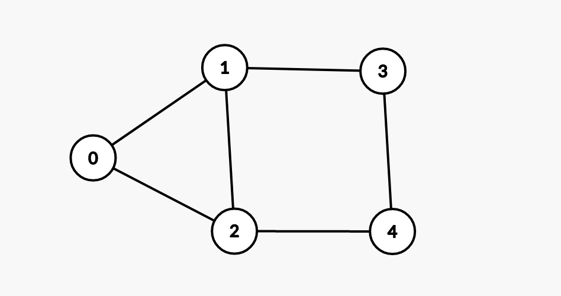

# csc340-graph-group-project  
## To-Do:  
• Declare a class Graph  
        - Adopt the adjacency list representation  
        - Represent each adjacency list as a "raw pointer"-based singly linked list  
        - Implement the big-3  
• Write functions to construct a graph such as adding vertices and edges  
• Implement the breadth first search algorithm  
• Print out the BFS-tree from a given source vertex  
• Print the shortest path from *s* to *v*  
• Unit tests  

## Graphs used in unit tests for getBFS() & getShortestPath()  
#### Graph 1  
  
#### Graph 2  
  
#### Graph 3  

